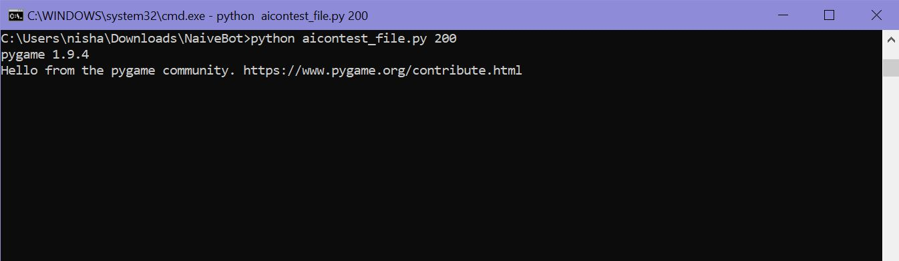
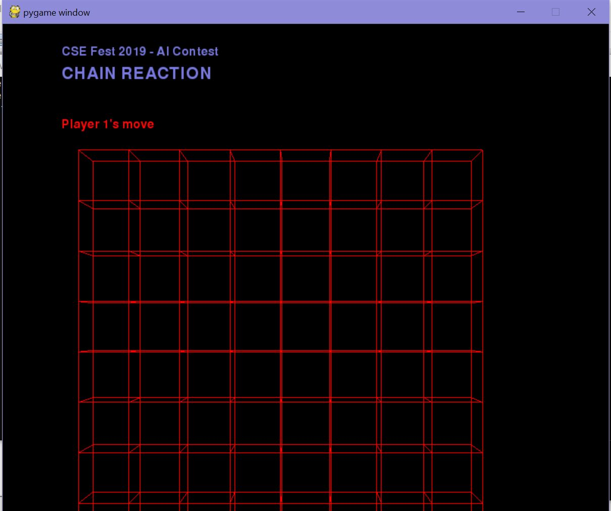
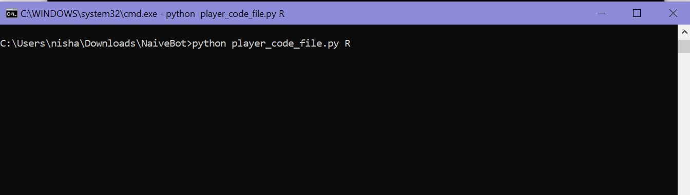
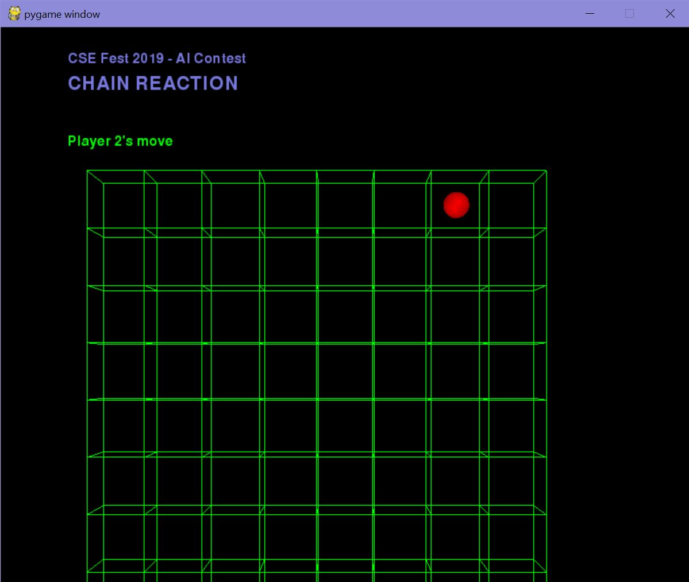
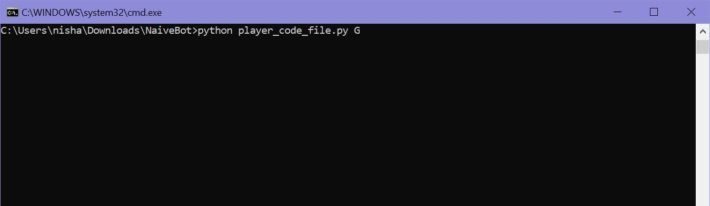
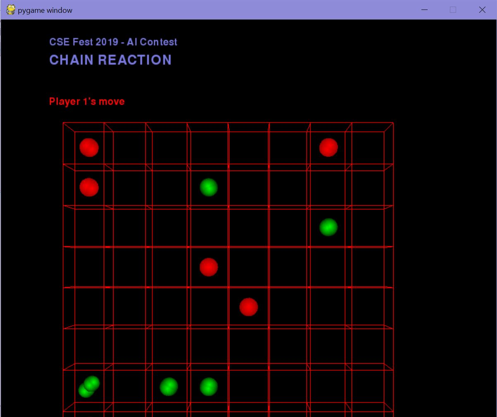
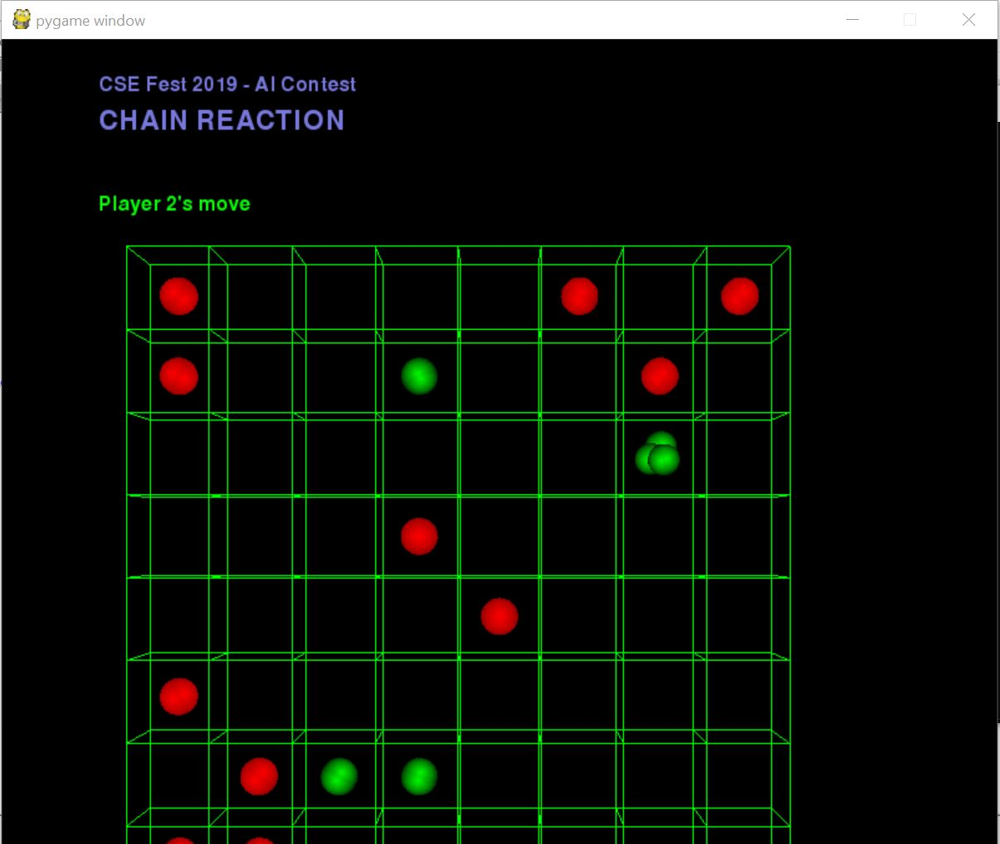

# NaiveBot

## Chain Reaction

### This is a bot for playing the two-player chain reaction game. 

Chain reaction is a two player game. 
- The environment is a m.n board.
- Two players - Red and Green, take turns to place balls (orbs) in his/her chosen square.
- Every cell has a critical mass. It can wither be 4 (for middle cells), 3 (for cells in the edge), and 2 (for the cells in the corners).
- One cell can contain more than one ball, but it will only contain balls of the same color.
- When a cell reaches its critical mass, it explodes. As a result of the explosion, the cell loses all the balls and each orthogonally adjacent cell gains one more ball with it's current number of balls. This process continues until there is no cell with a critical mass.
- When a red cell explodes and there are orthogonal green cell adjacent to it, all the green balls become red.
- When the whole board has only one color, the player for the corresponding color wins.

The rules of playing the game can also be found [here](https://brilliant.org/wiki/chain-reaction-game/).

## Play the game!

Starting the game:

Initial board:

Starting player 1:

Board state after starting player 1:

Starting player 2:

Board state after starting player 2:

Mid game:

